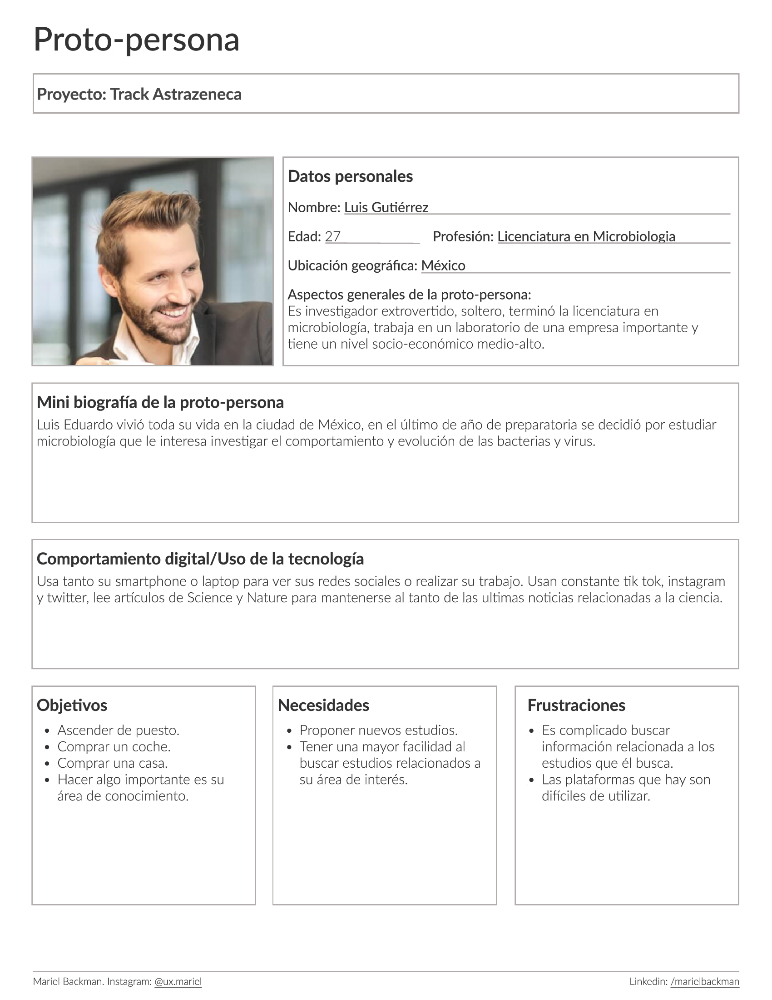
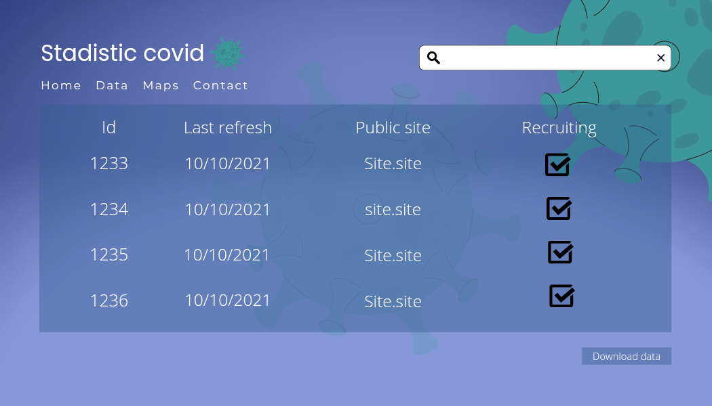
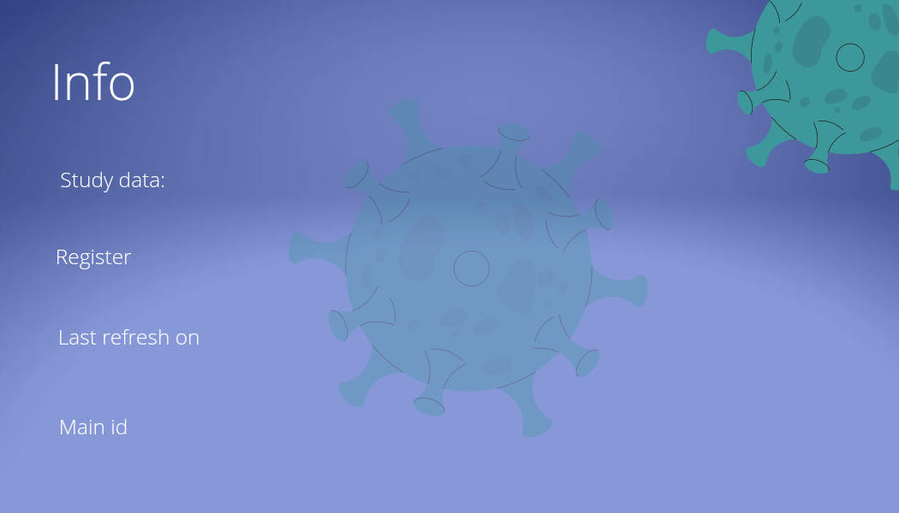
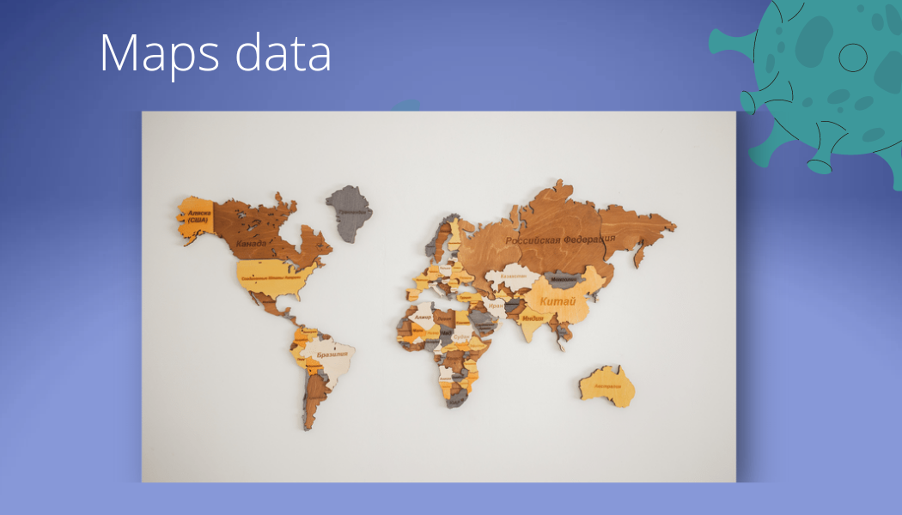

# Talent Hackaton 2022 
## Track astrazeneca
____

## Problematica 

Necesidad de una plataforma de descarga de donde se obtendrá un archivo con los resultados de estudios COVID-19 para la fabricación de vacunas y el cuál será mapeado a una base de datos, por medio de una aplicación web se construirán servicios para obtener estos datos en los cuáles existe la locación en la cual se hizo el estudio y utilizando una API de mapas (libre a la que el participante quiera escoger) se registrará.

## Solución propuesta

Para este proyecto se realizará una webApp en la cual vamos a mostrar la informacion de los datos de covid en 3 puntos, el primer serán datos generales sobre el covid de forma rápida, en el segundo punto tenemos otra muestra de información la cual será un poco más específica y en el 3 punto lo que haremos es colocar un mapa en el cual se mostrara el país y cuantos vacunados existen en ese país. 
Decidimos hacerlo así de simple para que cualquier persona que necesite ver esta información la pueda ver sin ningún problema y sin complicaciones ademas de que si se necesitan más datos se podrá descargar un archivo con todos los datos para un mayor estudio de los datos. 

## Tecnologías 

**Frontend**
- ReactJS
- API google maps

**Backend**
- Java
- Spring boot

**Despliegue**
- Azure static WebApps
- Azure for mysql
- Heroku

## Estudió de casos
Para profundizar un poco más sobre cómo se va usar la plataforma nos dimos a la tarea de crear una protopersona para poder simular un perfil el cual podría interacturar con nuestra aplicación. 
 

## Wireframe

## Diseño UI
 

###### © The Colossal Pythons 2022 :mexico:
